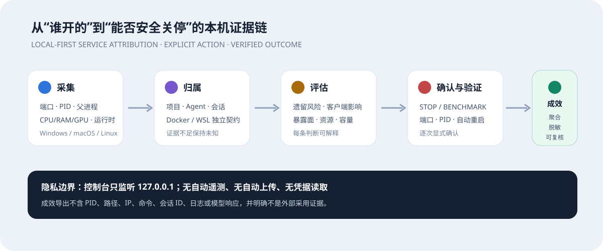

# Vibe Service Guardian

[Impact & evidence](IMPACT.md) · [Roadmap](ROADMAP.md) · [Maintainers](MAINTAINERS.md) · [Governance](GOVERNANCE.md) · [Security](SECURITY.md) · [Privacy](PRIVACY.md)

Vibe Service Guardian 0.8.3 (unreleased) is a local-first Windows, macOS, and Linux tool for service attribution, AI-runtime health checks, open-weight model capacity planning, and inference optimization. It answers which processes are listening, which project or agent chain they belong to, what a stop would affect, whether a service was relaunched, whether a running local model is healthy and safely exposed, which local models can satisfy a requested workload, and how far measured performance differs from the capacity prediction.

Version 0.8.3 adds no new workspace or automatic-control authority. It closes evidence gaps with disposable real-process stop/port/relaunch tests, a 35-request real-HTTP fixed workload matrix, versioned SQLite migration/backup/corruption recovery, SHA-256 wheel locks for supported platforms and Python versions, CI security gates, and explicit Docker/WSL PID and port ownership contracts. The current verdict remains a local single-user public Alpha candidate, not cross-platform production ready; see [docs/V0.8.3-CONVERGENCE.md](docs/V0.8.3-CONVERGENCE.md) and [docs/PRODUCTION-READINESS-0.8.3.md](docs/PRODUCTION-READINESS-0.8.3.md).

Version 0.8.1 adds a local service relationship graph, an explainable stop-assessment panel, bounded post-stop PID/port/relaunch verification, and a fixed previewable/cancellable workload matrix. The matrix runs 5 single-request samples, 10 samples at concurrency 2, and 20 samples at concurrency 4 only after `BENCHMARK PLAN <port>`. Resource guards are rechecked before each stage; VSG never expands the plan automatically or deliberately probes OOM. Optional catalog mapping feeds same-hardware/model/quantization/concurrency/context/output measurements back into capacity planning and displays signed and absolute prediction error. See [docs/V0.8.1-FEATURES.md](docs/V0.8.1-FEATURES.md).

## The 30-second view

VSG follows one local service through a complete evidence chain: **who opened it → project/agent ownership → stale-service assessment → stop impact → verified PID/port/relaunch outcome → local model and concurrency feasibility**.



Run `python -m vsg --open`, open a service detail, review its evidence, and record **confirmed stale / not stale / not sure**. The Local Impact dialog previews aggregate local outcomes. A redacted JSON download requires the exact `EXPORT REPORT` phrase, contains no PID/path/IP/command/session/log/model-response fields, and is never uploaded automatically. It is explicitly self-reported evidence, not proof of public adoption; see [IMPACT.md](IMPACT.md).

The 0.8 workspace adds correctable attribution rules and optional project-local `.vsg.yaml` manifests, a correlated service/log/resource timeline, a live network topology, and bounded local model inventory. Inventory runs only after an exact `SCAN MODELS` confirmation against an explicitly selected non-root directory. It does not follow symlinks, download, delete, move, or fully hash model files; persisted records use relative paths and a root digest rather than the absolute scan root. History categories can only be cleared after `CLEAR HISTORY` and never remove source models, projects, logs, or configuration files. See [docs/V0.8-FEATURES.md](docs/V0.8-FEATURES.md).

The bilingual Chinese/English web console binds only to `127.0.0.1`. First launch follows the browser language; the explicit toggle is persisted only in browser-local storage. It groups host processes, Windows services, Docker, WSL, and agent processes separately, with an additional local-model-runtime filter for Ollama, llama.cpp, vLLM, SGLang, MLX-LM, LM Studio, ComfyUI, TensorRT-LLM, Text Generation WebUI/ExLlama, TabbyAPI, and related servers. Process termination is limited to identified host development/model-serving runtimes and requires PID/create-time revalidation, a protected-process tree check, and `STOP <PID>` confirmation. LM Studio's main application remains read-only. Nothing is stopped automatically.

## AI runtime health check

The health workspace combines live CPU/RAM/disk/network readings with GPU/VRAM telemetry, runtime-specific read-only health endpoints, model/load/quantization/backend evidence, binding/authentication/firewall/reverse-proxy posture, restart history, and explicitly selected redacted log/config inspection. Unsupported temperature, fan, or power sensors remain unavailable; VSG does not invent estimates.

Passive metrics are preferred. An active short benchmark requires the exact `BENCHMARK <port>` phrase, uses a fixed synthetic prompt against a recognized loopback model service, caps concurrency/context/output, and does not deliberately drive the host into OOM. Configuration snapshots require `SNAPSHOT`; large weights receive manifests rather than automatic copies, while small configuration files can be restored only with `RESTORE <filename>`. Manually trusted private nodes are never discovered by LAN scanning and are contacted without credentials.

The overall result has five evidence domains: machine health, model performance, service security, service stability, and resource capacity. Unknown domains are excluded from the numeric score and add a `*`, so a clean known-evidence score is not presented as proof that every dimension was verified.

## Optimization advisor and redacted log monitoring

The optimization workspace closes the loop from detect → diagnose → recommend → benchmark → monitor → rollback. It displays the complete compatibility matrix across llama.cpp, Ollama, MLX-LM, vLLM, SGLang, TensorRT-LLM, and TabbyAPI/ExLlamaV2, ranking preferred candidates using OS, accelerator vendor, driver/compute capability, detected runtimes, weight format, concurrency, context, and user priority. Windows WSL2/Docker GPU routes remain explicitly marked preview. Recommendations never install an engine or change drivers, power limits, fan firmware, or model configuration.

Hardware advice is triggered only by measured RAM/VRAM/disk/temperature values, runtime health, requested workload, and redacted log events. Every item includes evidence, action, trade-off, confidence, and a validation method. Benchmark records are compared only when model name, concurrency, context, and output length all match.

Continuous monitoring is opt-in and requires `WATCH <PID>` for a recognized host model service and an explicitly selected ordinary log file. VSG incrementally classifies OOM, CUDA/ROCm/Metal/Vulkan, load, timeout, authentication, context, tool-template, crash, and CPU-fallback events. Raw logs are never stored; the Web API returns only redacted short events and the file name. Watches are bound to service fingerprint, PID, and process start time, and stop when that identity changes. Redacted events default to seven-day retention.

## Model capacity planning

The planner reads a privacy-minimized CPU/RAM/GPU or Apple unified-memory profile and detects local Ollama, llama.cpp, LM Studio CLI, MLX-LM, vLLM, and SGLang runtimes. Users set total users, peak concurrency, prompt/context/output lengths, per-user generation speed, and TTFT targets. Results separate weight, KV-cache, workspace, current headroom, Dense versus MoE total/active parameters, and prediction confidence.

The bundled catalog is a dated, non-exhaustive offline snapshot covering an initial Qwen3.5, OpenAI gpt-oss, Gemma 4, Mistral Small 4, and DeepSeek-V4-Flash set. VSG never downloads a model or executes a generated serving command. Optional llama-bench calibration requires explicit `BENCHMARK` confirmation and stores no absolute model path. See [docs/MODEL-CAPACITY.md](docs/MODEL-CAPACITY.md).

## Platform status

- Windows 10/11 x64: source and unsigned portable build path; current Windows-host tests are available.
- macOS 13+ arm64/x86_64: native build and validation scripts are provided, but both architectures still require real-Mac acceptance evidence.
- Ubuntu 22.04+ and graphical Linux on x86_64/aarch64: supported code, browser UI, desktop launcher template, and native build/validation chain; native ELF acceptance remains required on each target architecture.

## Agent coverage

Process/project detection includes Codex Desktop/CLI, Claude Code, Cursor, Windsurf, VS Code, WorkBuddy/CodeBuddy, Hermes Agent, OpenCode, Aider, Gemini CLI, Goose, and common Windows/macOS/Linux terminals. Session attribution is intentionally narrower and only appears when stable local metadata, a matching project/time window, or an explicit resume identifier exists. See [docs/AGENT-SUPPORT.md](docs/AGENT-SUPPORT.md).

## Run from source

Python 3.10–3.12 is supported. This Python 3.12 example uses the Windows lock; select the matching OS and `py310`/`py311` lock when applicable.

```text
python -m venv .venv
python -m pip install --only-binary=:all: --no-deps --require-hashes -r requirements-lock/bootstrap-py3.txt
python -m pip install --only-binary=:all: --no-deps --require-hashes -r requirements-lock/runtime-windows-py312.txt
python -m vsg --open
python -m unittest discover -s tests -v
```

Runtime data stays under `data/` by default. Review [PRIVACY.md](PRIVACY.md), [SECURITY.md](SECURITY.md), [docs/ARCHITECTURE.md](docs/ARCHITECTURE.md), and the evidence boundaries in [docs/VALIDATION.md](docs/VALIDATION.md) before use or contribution.

On Ubuntu/Linux, run `./Setup-Linux.sh` and `./Start-VSG.sh` from source. The optional user-local application-menu entry is installed only when explicitly requested with `VSG_INSTALL_DESKTOP_LAUNCHER=1 ./Setup-Linux.sh`; it requires no sudo. Native unsigned packages are built with `./scripts/Build-Portable-Linux.sh` and verified with `./scripts/Validate-Linux.sh`.

This project is independent and is not affiliated with or endorsed by OpenAI, Anthropic, Cursor, Windsurf, Microsoft, Hermes, OpenCode, or other detected products.
